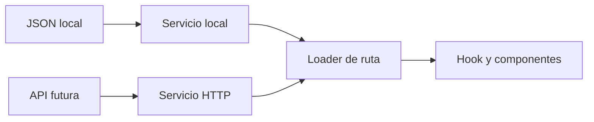

# PROALIMEC - Fase 1: Inicialización y estructura

## 1. Objetivo de esta fase

La primera fase se concentra únicamente en crear una base técnica ordenada y escalable para la web de PROALIMEC.

Al terminar esta fase deben existir:

- el proyecto React inicializado;
- las rutas principales funcionando;
- la distribución definitiva de carpetas;
- las tres secciones principales creadas como módulos independientes;
- contratos tipados para datos y servicios;
- archivos JSON preparados como fuentes locales;
- servicios locales capaces de leer los mocks;
- hooks tipados para entregar datos a las páginas;
- documentación interna de cada sección;
- pruebas mínimas de estructura y un build exitoso.

En esta fase **no se desarrollará el diseño final**, no se cargarán los productos reales y no se crearán las animaciones definitivas.

---

## 2. Secciones principales

La aplicación se dividirá en tres secciones verticales:

| Sección | Ruta | Componente principal | Responsabilidad |
|---|---|---|---|
| Homepage | `/` | `HomePage.tsx` | Presentar la empresa, propuesta de valor, categorías destacadas y accesos comerciales. |
| Catálogo de productos | `/productos` | `ProductCatalogPage.tsx` | Mostrar productos, categorías, búsqueda, filtros y acceso al detalle. |
| Contáctanos | `/contacto` | `ContactPage.tsx` | Mostrar WhatsApp, teléfono, correo, ubicación, horarios y llamadas a la acción. |

El detalle `/productos/:slug` pertenece a la sección `product-catalog`; no debe convertirse en una cuarta sección independiente.

El nombre de la carpeta raíz será `sections/` en plural. En este proyecto, “section” significa un módulo vertical de negocio o página, no únicamente una etiqueta HTML `<section>`.

---

## 3. Convenciones de nombres

- Carpetas: `kebab-case`.
- Componentes React: `PascalCase.tsx`.
- Hooks: `use-kebab-case.ts` y nombre interno `useCamelCase`.
- Servicios: `kebab-case.service.ts`.
- Adaptadores locales: `kebab-case.local.service.ts`.
- Schemas: `kebab-case.schema.ts`.
- Tipos: `kebab-case.types.ts`.
- Mocks: `kebab-case.mock.json`.
- Pruebas: mismo nombre del archivo con `.test.ts` o `.test.tsx`.
- Contenido visible: español.
- Código, archivos y variables: inglés.

Se usará `services/` en plural para mantener consistencia con `components/`, `hooks/` y `mocks/`.

`HomePageStoryBook.md`, `ProductCatalogStoryBook.md` y `ContactStoryBook.md` serán archivos Markdown de documentación interna. **No se instalará la librería Storybook en esta fase.**

---

## 4. Stack inicial de la fase

- React.
- TypeScript con modo estricto.
- React Router Framework Mode.
- Vite.
- Tailwind CSS.
- Zod para validar JSON y configuración.
- Vitest y React Testing Library.
- ESLint y Prettier.

GSAP se instalará cuando empiece la fase de movimiento. No debe agregarse todavía si ningún componente de esta fase lo utiliza.

### Inicialización sugerida

```bash
npx create-react-router@latest proalimec-web
cd proalimec-web
npm install
npm install zod clsx tailwind-merge
npm install tailwindcss @tailwindcss/vite
npm install -D vitest @testing-library/react @testing-library/jest-dom @testing-library/user-event jsdom prettier
npm run dev
```

Conservar el lockfile generado. No actualizar dependencias sin una razón concreta durante el desarrollo.

---

## 5. Estructura general del proyecto

```text
proalimec-web/
├── app/
│   ├── root.tsx
│   ├── routes.ts
│   ├── app.css
│   │
│   ├── routes/
│   │   ├── home.route.tsx
│   │   ├── products.route.tsx
│   │   ├── product-detail.route.tsx
│   │   ├── contact.route.tsx
│   │   └── not-found.route.tsx
│   │
│   ├── sections/
│   │   ├── home-page/
│   │   ├── product-catalog/
│   │   └── contact/
│   │
│   ├── shared/
│   │   ├── components/
│   │   ├── config/
│   │   ├── hooks/
│   │   ├── lib/
│   │   ├── services/
│   │   ├── styles/
│   │   └── types/
│   │
│   └── test/
│       └── setup.ts
│
├── public/
│   ├── assets/
│   │   ├── brand/
│   │   ├── home/
│   │   ├── products/
│   │   └── contact/
│   └── fonts/
│
├── tests/
│   └── smoke/
├── .env.example
├── react-router.config.ts
├── tsconfig.json
├── vite.config.ts
├── package.json
└── README.md
```

### Responsabilidades de nivel superior

- `routes/`: conecta URLs, loaders, metadata y páginas. No contiene componentes visuales complejos.
- `sections/`: contiene cada módulo vertical completo.
- `shared/`: contiene únicamente piezas reutilizadas por dos o más secciones.
- `public/assets/`: almacena archivos públicos optimizados; los JSON de negocio no van aquí.
- `tests/`: pruebas globales o smoke tests. Las pruebas específicas permanecen cerca de su sección.

Regla de dependencia:

```text
routes -> sections -> shared
```

- `shared` no puede importar desde `sections`.
- Una sección no debe importar archivos internos de otra sección.
- Cada sección expone su API pública mediante `index.ts`.

---

## 6. Estructura de Homepage

```text
app/sections/home-page/
├── components/
│   └── index.ts
├── hooks/
│   ├── use-home-page-data.ts
│   └── use-home-page-data.test.ts
├── loaders/
│   └── home-page.loader.ts
├── mocks/
│   └── home-page.mock.json
├── schemas/
│   └── home-page.schema.ts
├── services/
│   ├── home-page.service.ts
│   └── home-page.local.service.ts
├── types/
│   └── home-page.types.ts
├── HomePageStoryBook.md
├── HomePage.tsx
└── index.ts
```

### Responsabilidades

- `HomePage.tsx`: compone la página; no obtiene ni transforma datos directamente.
- `components/`: en fases posteriores contendrá Hero, categorías, beneficios, productos destacados y CTA.
- `mocks/home-page.mock.json`: contenido local provisional y posteriormente aprobado.
- `schemas/home-page.schema.ts`: valida la forma del JSON.
- `services/home-page.service.ts`: define el contrato del servicio.
- `services/home-page.local.service.ts`: implementación que lee el JSON.
- `loaders/home-page.loader.ts`: llama al servicio desde React Router.
- `hooks/use-home-page-data.ts`: ofrece acceso tipado a los datos del loader.
- `HomePageStoryBook.md`: documenta componentes, reglas y decisiones de la sección.

Durante esta fase `components/` puede contener únicamente su `index.ts`. No crear Hero ni bloques visuales finales todavía.

---

## 7. Estructura del catálogo

```text
app/sections/product-catalog/
├── components/
│   └── index.ts
├── hooks/
│   ├── use-product-catalog-data.ts
│   └── use-catalog-filters.ts
├── loaders/
│   ├── product-catalog.loader.ts
│   └── product-detail.loader.ts
├── mocks/
│   ├── categories.mock.json
│   └── products.mock.json
├── schemas/
│   ├── category.schema.ts
│   └── product.schema.ts
├── services/
│   ├── product-catalog.service.ts
│   └── product-catalog.local.service.ts
├── types/
│   └── product-catalog.types.ts
├── ProductCatalogStoryBook.md
├── ProductCatalogPage.tsx
├── ProductDetailPage.tsx
└── index.ts
```

### Responsabilidades

- `ProductCatalogPage.tsx`: compone catálogo, controles y resultados.
- `ProductDetailPage.tsx`: muestra un producto identificado por `slug`.
- `products.mock.json`: fuente estática de productos.
- `categories.mock.json`: fuente estática de categorías.
- `product-catalog.service.ts`: contrato para listar, buscar y obtener un producto.
- `product-catalog.local.service.ts`: implementación basada en JSON.
- `use-product-catalog-data.ts`: entrega datos tipados del loader.
- `use-catalog-filters.ts`: administra criterios de búsqueda y filtros; no lee archivos JSON.
- `ProductCatalogStoryBook.md`: reglas del catálogo, tarjetas, filtros, estados y detalle.

En esta fase los arrays pueden estar vacíos o incluir uno o dos registros claramente marcados como datos técnicos temporales. No cargar productos inventados como si fueran información real de PROALIMEC.

---

## 8. Estructura de Contacto

```text
app/sections/contact/
├── components/
│   └── index.ts
├── hooks/
│   └── use-contact-data.ts
├── loaders/
│   └── contact.loader.ts
├── mocks/
│   └── contact.mock.json
├── schemas/
│   └── contact.schema.ts
├── services/
│   ├── contact.service.ts
│   └── contact.local.service.ts
├── types/
│   └── contact.types.ts
├── ContactStoryBook.md
├── ContactPage.tsx
└── index.ts
```

### Responsabilidades

- `ContactPage.tsx`: compone la información de contacto.
- `contact.mock.json`: datos provisionales de teléfono, WhatsApp, correo, dirección y horarios.
- `contact.service.ts`: contrato para obtener la información.
- `contact.local.service.ts`: lee y valida el JSON.
- `use-contact-data.ts`: expone los datos tipados.
- `ContactStoryBook.md`: documenta reglas de CTA, enlaces y estados.

No inventar datos de contacto. Usar valores como `[PENDIENTE_WHATSAPP]` únicamente en desarrollo y bloquear el build de producción mientras permanezcan placeholders críticos.

---

## 9. Flujo de datos preparado para un backend futuro



La interfaz no debe importar JSON directamente. El acceso debe seguir este recorrido:

```text
Página -> hook tipado -> loader -> contrato de servicio -> implementación local -> JSON
```

Cuando exista backend, se añadirá una implementación HTTP del mismo contrato:

```text
Página -> mismo hook -> mismo loader -> mismo contrato -> implementación HTTP -> API
```

Así los componentes no necesitan saber si los datos vienen de un JSON o de un endpoint.

### Regla importante

No simular latencia con `setTimeout` dentro del servicio local. Los estados de carga se prueban inyectando un servicio controlado en tests, no haciendo más lenta la aplicación real.

---

## 10. Contratos de servicio

### Homepage

```ts
export interface HomePageService {
  getContent(): Promise<HomePageContent>;
}
```

### Catálogo

```ts
export interface ProductCatalogService {
  getCategories(): Promise<ProductCategory[]>;
  getProducts(): Promise<Product[]>;
  getProductBySlug(slug: string): Promise<Product | null>;
}
```

La búsqueda y los filtros visuales se ejecutarán inicialmente sobre el array local. El contrato puede crecer cuando exista una API, sin diseñar hoy parámetros que todavía no se necesitan.

### Contacto

```ts
export interface ContactService {
  getContactInformation(): Promise<ContactInformation>;
}
```

### Implementación local

```ts
import homePageMock from "../mocks/home-page.mock.json";
import { HomePageSchema } from "../schemas/home-page.schema";
import type { HomePageService } from "./home-page.service";

export const localHomePageService: HomePageService = {
  async getContent() {
    return HomePageSchema.parse(homePageMock);
  },
};
```

El `async` conserva el contrato futuro. No significa que se deba fingir una petición HTTP.

---

## 11. Loaders y hooks

Los servicios se llaman desde loaders de React Router para que la misma estructura funcione con prerenderizado y con una API futura.

### Loader

```ts
import { services } from "~/shared/services/service-registry";

export async function homePageLoader() {
  return services.homePage.getContent();
}
```

### Hook tipado

```ts
import { useLoaderData } from "react-router";
import type { homePageLoader } from "../loaders/home-page.loader";

export function useHomePageData() {
  return useLoaderData<typeof homePageLoader>();
}
```

### Uso en la página

```tsx
import { useHomePageData } from "./hooks/use-home-page-data";

export function HomePage() {
  const content = useHomePageData();

  return (
    <main>
      <h1>{content.pageTitle}</h1>
    </main>
  );
}
```

En la Fase 1 la página solo necesita demostrar que el flujo está conectado. No debe contener el diseño definitivo.

---

## 12. Reglas para los JSON

- JSON contiene datos, nunca funciones, JSX ni lógica.
- Cada archivo tiene un schema Zod asociado.
- Los nombres de propiedades permanecen en inglés.
- El contenido visible permanece en español.
- Las rutas de imágenes son strings relativas a `public/assets`.
- IDs y slugs deben ser únicos.
- No almacenar datos duplicados que puedan derivarse.
- No agregar precios, stock o certificaciones no entregadas.
- No importar JSON desde un componente.
- Validar todos los mocks en pruebas y durante el build.

Ejemplo estructural provisional para `home-page.mock.json`:

```json
{
  "status": "pending-content",
  "pageTitle": "[PENDIENTE_TITULO_HOME]",
  "featuredProductIds": [],
  "sections": []
}
```

Ejemplo estructural provisional para `products.mock.json`:

```json
{
  "status": "pending-content",
  "products": []
}
```

Los placeholders deben ser fáciles de encontrar con una búsqueda global:

```bash
rg "PENDIENTE_|pending-content" app
```

---

## 13. Contenido de los archivos StoryBook Markdown

Cada sección tendrá un archivo de documentación con esta plantilla:

```md
# Nombre de la sección

## Propósito
Qué necesidad del usuario y del negocio resuelve.

## Ruta
URL y componente principal.

## Componentes
Nombre, responsabilidad, props y estados.

## Fuente de datos
Mock actual, schema, servicio y posible endpoint futuro.

## Reglas de negocio
Condiciones que deben respetarse.

## Estados de interfaz
Default, loading, empty, error y success cuando correspondan.

## Responsive
Comportamiento móvil, tablet y desktop.

## Accesibilidad
Semántica, teclado, foco, labels y movimiento reducido.

## Animaciones
Reservado para una fase posterior.

## Decisiones
Razón de las elecciones técnicas y visuales.

## Pendientes
Datos, recursos o aprobaciones faltantes.
```

Esta documentación debe actualizarse junto al código. No debe convertirse en una descripción genérica que deje de representar la sección real.

---

## 14. Archivos shared permitidos en esta fase

```text
app/shared/
├── components/
│   ├── AppShell.tsx
│   └── index.ts
├── config/
│   └── site.config.ts
├── lib/
│   └── cn.ts
├── services/
│   └── service-registry.ts
├── styles/
│   ├── tokens.css
│   └── fonts.css
└── types/
    └── common.types.ts
```

No mover algo a `shared` solo porque “podría reutilizarse”. Debe existir uso real en dos o más secciones, o ser una pieza transversal como configuración, layout o registro de servicios.

### Registro de servicios

`service-registry.ts` define qué implementación utiliza la aplicación:

```ts
export const services = {
  homePage: localHomePageService,
  productCatalog: localProductCatalogService,
  contact: localContactService,
} as const;
```

En una fase futura se podrá cambiar un adaptador local por uno HTTP sin modificar los componentes.

---

## 15. Configuración de rutas

`app/routes.ts` debe registrar como mínimo:

```ts
import {
  index,
  route,
  type RouteConfig,
} from "@react-router/dev/routes";

export default [
  index("./routes/home.route.tsx"),
  route("productos", "./routes/products.route.tsx"),
  route("productos/:slug", "./routes/product-detail.route.tsx"),
  route("contacto", "./routes/contact.route.tsx"),
  route("*", "./routes/not-found.route.tsx"),
] satisfies RouteConfig;
```

Cada módulo de ruta debe:

1. importar su loader desde la sección;
2. exportar metadata provisional;
3. renderizar el componente principal;
4. no duplicar lógica del servicio.

---

## 16. Qué se implementa exactamente en la Fase 1

### Inicialización

- crear el repositorio/proyecto;
- configurar TypeScript estricto;
- configurar alias `~/`;
- configurar Tailwind;
- configurar ESLint y Prettier;
- configurar Vitest y Testing Library;
- agregar scripts `dev`, `build`, `typecheck`, `lint`, `format:check` y `test`;
- crear `.env.example` sin credenciales reales.

### Estructura

- crear todas las carpetas indicadas;
- crear los tres módulos verticales;
- crear rutas y páginas mínimas;
- crear tipos, schemas, contratos, adaptadores locales, loaders y hooks mínimos;
- crear JSON válidos de estructura provisional;
- crear los tres archivos StoryBook Markdown;
- crear `shared` solo con elementos transversales reales.

### Verificación

- las cuatro rutas deben abrir sin errores;
- los loaders deben obtener datos desde los servicios locales;
- ningún componente debe importar JSON directamente;
- todos los mocks deben pasar Zod;
- las pruebas mínimas deben pasar;
- el build debe completarse.

---

## 17. Qué no se implementa todavía

- diseño final de Homepage;
- catálogo visual definitivo;
- tarjetas de producto terminadas;
- filtros funcionales completos;
- galería final;
- integración de WhatsApp;
- productos o contactos reales;
- fotografías finales;
- animaciones GSAP;
- SEO final y datos estructurados;
- analytics;
- despliegue productivo;
- dominio y DNS.

Si algo de esta lista aparece durante la Fase 1, debe mantenerse como un placeholder técnico mínimo o devolverse al backlog de la fase correspondiente.

---

## 18. Pruebas mínimas

Crear pruebas para confirmar:

- que cada JSON cumple su schema;
- que el servicio local de Homepage devuelve contenido válido;
- que el catálogo devuelve un array válido aunque esté vacío;
- que buscar un slug inexistente devuelve `null`;
- que el servicio de contacto devuelve una estructura válida;
- que las páginas principales renderizan su H1 provisional;
- que no existen imports directos desde `components` hacia `mocks`.

No establecer porcentajes altos de cobertura en esta fase. El objetivo es validar las fronteras arquitectónicas.

---

## 19. Criterios de aceptación

La Fase 1 termina cuando:

- [ ] El proyecto inicia con `npm run dev`.
- [ ] `npm run typecheck` termina sin errores.
- [ ] `npm run lint` termina sin errores.
- [ ] `npm run test` termina sin errores.
- [ ] `npm run build` termina sin errores.
- [ ] `/`, `/productos`, `/productos/:slug`, `/contacto` y 404 están registradas.
- [ ] Existen `home-page`, `product-catalog` y `contact` dentro de `app/sections`.
- [ ] Cada sección contiene `components`, `mocks`, `hooks`, `loaders`, `schemas`, `services` y `types`.
- [ ] Cada sección tiene su archivo `*StoryBook.md`.
- [ ] Los componentes no importan JSON.
- [ ] Los servicios locales validan JSON con Zod.
- [ ] Los loaders dependen del contrato de servicio.
- [ ] Los hooks entregan datos tipados.
- [ ] No se instalaron librerías sin uso.
- [ ] No se implementaron funcionalidades de fases posteriores.
- [ ] No existen secretos ni información empresarial inventada.

---

## 20. Orden de ejecución para OpenCode

1. Leer este documento completo.
2. Revisar si el directorio ya contiene un proyecto para no sobrescribir trabajo.
3. Inicializar React Router Framework Mode si el proyecto no existe.
4. Configurar herramientas de calidad.
5. Crear `shared` mínimo.
6. Crear `home-page` de extremo a extremo.
7. Ejecutar validaciones.
8. Repetir la estructura con `product-catalog`.
9. Ejecutar validaciones.
10. Repetir la estructura con `contact`.
11. Registrar rutas y 404.
12. Crear y completar documentación StoryBook Markdown.
13. Ejecutar `typecheck`, `lint`, `test` y `build`.
14. Reportar archivos creados, decisiones, resultados y pendientes.

Trabajar un módulo completo a la vez. No crear primero todas las carpetas vacías y dejar las conexiones para después.

---

## 21. Prompt inicial para OpenCode

```text
Lee FASE_1_INICIALIZACION_ESTRUCTURA_PROALIMEC.md completo y úsalo como alcance obligatorio.

Ejecuta únicamente la Fase 1: inicialización y estructura.

Antes de modificar archivos:
1. inspecciona el directorio actual;
2. informa si ya existe un proyecto o cambios que deban preservarse;
3. resume las decisiones arquitectónicas que aplicarás.

Después:
- inicializa o configura React Router Framework Mode con TypeScript;
- crea las rutas Home, Productos, Detalle de producto, Contacto y 404;
- organiza app/sections con home-page, product-catalog y contact;
- aplica la estructura components, mocks, hooks, loaders, schemas, services y types;
- crea servicios locales sobre JSON, validados con Zod;
- conecta loader -> servicio -> JSON y hook -> loader;
- crea HomePageStoryBook.md, ProductCatalogStoryBook.md y ContactStoryBook.md;
- utiliza únicamente placeholders claramente marcados;
- no desarrolles diseño final, productos reales, WhatsApp ni animaciones;
- no instales GSAP todavía;
- ejecuta typecheck, lint, test y build.

Al finalizar, entrega:
1. resumen del resultado;
2. árbol real de archivos;
3. comandos ejecutados;
4. pruebas realizadas y su resultado;
5. placeholders y decisiones pendientes;
6. confirmación de que no se avanzó a otra fase.
```

---

## 22. Resultado esperado

La primera fase no busca una página visualmente terminada. Busca una base que permita construir cada sección sin mezclar responsabilidades.

El resultado correcto será una aplicación mínima que compile, navegue y demuestre este flujo:

```text
JSON validado -> servicio local -> loader -> hook tipado -> página
```

Cuando PROALIMEC disponga de un backend, la implementación local se podrá reemplazar por un servicio HTTP conservando el contrato, los hooks y la mayoría de los componentes.
